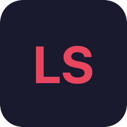

<p align="center">
  
</p>

<h1 align="center">LSLS</h1>

<p align="center">
  A native macOS music player for local libraries and Plex servers.
</p>

<p align="center">
  <a href="https://github.com/zeroknots/flacmusic/releases/latest"><strong>Download DMG</strong></a>
</p>

---

## Features

**Library** — Import folders of music. LSLS reads metadata via ffprobe and organizes by artist, album, and track. Supports FLAC, MP3, M4A, AAC, WAV, AIFF, ALAC, and OGG.

**Plex** — Connect to Plex servers via OAuth. Browse and stream music directly from your Plex libraries.

**DAP Sync** — Sync tracks, albums, or artists to portable audio players (Rockbox, etc.). Auto-syncs when a device is connected. Cleans up orphaned files.

**Playlists** — Manual playlists with drag-and-drop, plus smart playlists with rule-based filters.

**Theming** — JSON-based themes loaded from `~/.config/lsls/theme.json` with hot-reload. Ships with Dark Minimal, Light Clean, and Nord.

**Now Playing** — Menu bar widget, macOS media key support, audio format display (codec, sample rate, bit depth), and queue management with drag-and-drop reordering.

## Requirements

- macOS 15+
- [Homebrew](https://brew.sh) `ffmpeg` (used for metadata extraction)

```sh
brew install ffmpeg
```

## Build from source

```sh
swift build -c release
scripts/build-app.sh      # creates LSLS.app
scripts/create-dmg.sh     # creates distributable DMG
```

## Theme

Drop a `theme.json` in `~/.config/lsls/` to customize colors, typography, spacing, and vibrancy. Changes are picked up immediately.

```jsonc
// ~/.config/lsls/theme.json
{
  "colors": {
    "accent": "#E8455E",
    "background": "#191A2E"
  }
}
```

Built-in themes: **Dark Minimal** (default), **Light Clean**, **Nord**.
